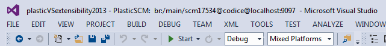
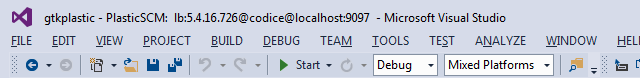
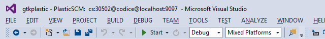

vstitle4plastic
---------------

Visual Studio extension to show the current branch, label or changeset where the Plastic SCM workspace is pointing:

History
-------
This plugin modifies in a "hacked" way the window title to include information about the Plastic SCM workspace. The extension needs to recalculate the whole window title every time, so this could cause the window title to contain unexpected data under certain conditions.

The window title is only customized when a solution is open. When one or several documents are opened with no active solution, the extension will not show any Plastic SCM related info: each document could be in a different workspace.

Configuration
-------------
If you have a custom "WkConfigDir" setting in your client.conf file, you must edit the DEFAULT_WK_CONFIG_DIR constant value located in the "SelectorWatcher.cs" file (see plugin source code) and set its value to your custom value. The same happens with DEFAULT_PLASTIC_COMMAND constant if you have a custom command name for Plastic (default is "cm").

How it works
------------
When adding a solution to source control, if the solution is not contained inside a plastic workspace you will need to close and reopen the solution again to see the workspace information in the window title. The same thing occurs if the plastic workspace is created outside Visual Studio.

The solution includes a reference to CmdRunner.dll (source code available at https://github.com/PlasticSCM/plastic-cmdrunner). This tool allows developers to run commands from an external application. If you want to include the CmdRunner source code inside the plugin solution, you will have to generate a key file to sign it. 

Binaries
--------
The binary files for the extension are available at the Visual Studio Gallery, you can download them here: https://visualstudiogallery.msdn.microsoft.com/bbfc6ce9-4b6e-4e26-a101-9e6f5d039eb1

Supported versions of Visual Studio
-----------------------------------
Supported versions: greater or equal than Visual Studio 2012.

Examples
--------

These are some other examples of customized window titles with label and changeset info:

